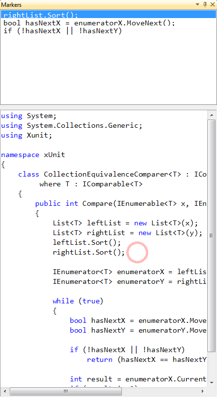

# 'Markers ToolWindow' for CodeRush #

This plugin provides an additional tool window which shows the current stack of Markers within the system

It updates itself when Markers are added or removed, and allows navigation via a double-click

Additionally a preview of the code in which a Marker sits is available.

See [this blogpost](https://community.devexpress.com/blogs/markmiller/archive/2011/03/22/creating-coderush-plug-ins-actions-and-tool-windows.aspx) for more details.  

